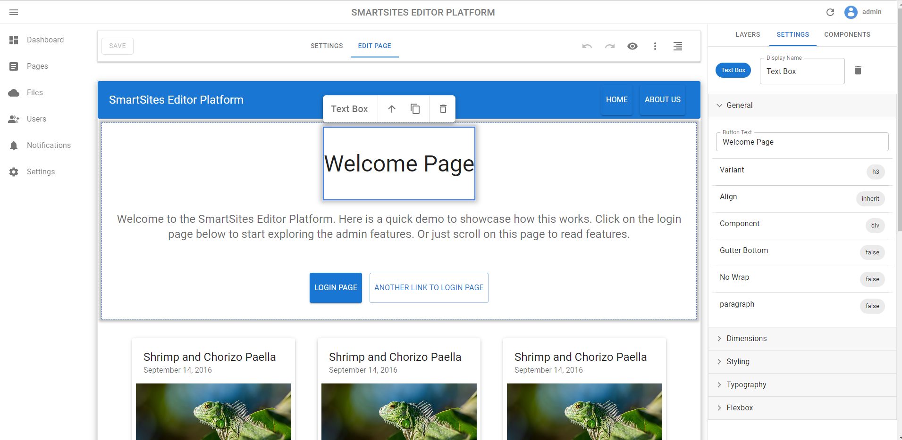

<p align="center">
    
</p>
<h1 align="center">Smartsites Editor Platform</h1>
<p align="center">
    <a href="https://discord.gg/tR4vuHb7wj">
        
    </a>
    <a href="https://github.com/MartinMarwad/smartsites-editor-platform">
        
    </a>
    <a href="https://calver.org/">
        
    </a>
</p>

## Table of Contents
- [Table of Contents](#table-of-contents)
- [Introduction](#introduction)
- [Features](#features)
- [Getting Started](#getting-started)
    - [Docker](#docker)
    - [Running the project](#running-the-project)
- [Technologies Used](#technologies-used)

## Introduction
The Smartsites Editor Platform (SEP) is an open-source full-stack platform for creating, publishing, and managing dynamic website content with zero code. 


## Features
General features include:
- [x] Live WYSIWYG content editing: 
- [x] Dynamic content management:
    - [x] Ability to create dynamic pages with content.
    - [x] Seamless media management with upload/download capabilities.
- [ ] Website Administration:
    - [ ] Website traffic analysis

## Getting Started

### Docker
To get started, you will need to have [Docker](https://docs.docker.com/get-docker/) installed.

If you are running Windows, you can install with [WinGet](https://github.com/microsoft/winget-cli):
```
winget install Docker.DockerDesktop
```

### Running the project
1. Clone the project:
```
git clone https://github.com/MartinMarwad/smartsites-editor-platform
```

2. Build the docker image:
```
make build
```

3. Run the docker image:
- To run the image in development mode:
```
make up
```
- To run the image in production mode:
```
make up.prod
```

4. Open the browser and navigate to http://localhost:8000/admin/. The default username is `admin` and the default password is `password`.

To stop the container:
```
make down
```

## Technologies Used
- General:
    - [Docker](https://github.com/docker): Provides core the development/deployment environment.
- [React](https://github.com/reactjs) Frontend: 
    - [MUI](https://github.com/mui-org/material-ui): Frontend Material Design themed UI framework.
    - [React Admin](https://github.com/marmelab/react-admin): Provides the frontend admin.
    - [React Router](https://github.com/remix-run/react-router): Provides client side URL routing. 
    - [Craft.js](https://github.com/prevwong/craft.js/): Provides the core drag-and-drop functionality of Smartsites.
- [Django](https://github.com/django) Backend:
    - [Whitenoise](https://github.com/evansd/whitenoise): Provides static/media file serving within Python.
    - [Django CRA Helper](https://github.com/MasterKale/django-cra-helper): Provides useful integration between Django and React. 
    - [Django Rest Framework](https://github.com/encode/django-rest-framework): Provides a RESTful API for the React frontend to consume. 
        - [SimpleJWT](https://github.com/jazzband/djangorestframework-simplejwt): Provides JSON Web Token authentication for the Django Rest Framework.
    - [Django DB Logger](https://github.com/CiCiUi/django-db-logger): Allows saving logging messages into the database.
    - [Django Dynamic Preferences](https://github.com/agateblue/django-dynamic-preferences): Allows us to save and store global site settings.
